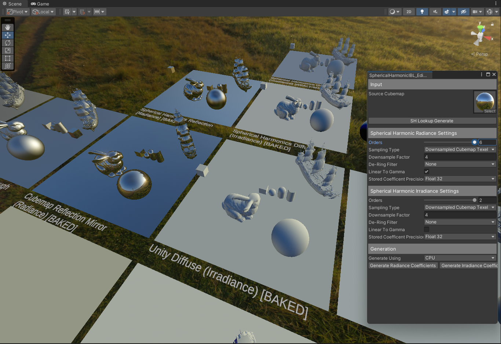

# Unity Spherical Harmonic Experiments

This is a personal project where I explore and experiment with Spherical Harmonics.

Most importantly I will be writing and sharing my results/experiments as time goes on, which are all from the perspective of a guy who is not math oriented nor that technically minded.
- [Spherical Harmonic Coefficent Precison Reduction](https://github.com/frostbone25/Unity-Spherical-Harmonic-Experiments/blob/main/CoefficentPrecison.md)

# Credits / Sources

- [pieroaccardi's Spherical Harmonic Tools](https://github.com/pieroaccardi/Unity_SphericalHarmonics_Tools/tree/master)
- [Peter Sloan Stupid Spherical Harmonic Tricks](https://www.ppsloan.org/publications/StupidSH36.pdf)
- [Peter Sloan Deringing Spherical Harmonics](https://www.ppsloan.org/publications/shdering.pdf)
- [Pema99 SHTools](https://github.com/pema99/SHTools)
- [Pema99 ZH3](https://gist.github.com/pema99/f735ca33d1299abe0e143ee94fc61e73)
- [GPU Gems 2: Chapter 10. Real-Time Computation of Dynamic Irradiance Environment Maps](https://developer.nvidia.com/gpugems/gpugems2/part-ii-shading-lighting-and-shadows/chapter-10-real-time-computation-dynamic)
- [davidar Environment Importance Sampling](https://compute.toys/view/19)
- [Extracting dominant light from Spherical Harmonics](https://www.gamedeveloper.com/programming/in-depth-extracting-dominant-light-from-spherical-harmonics)
